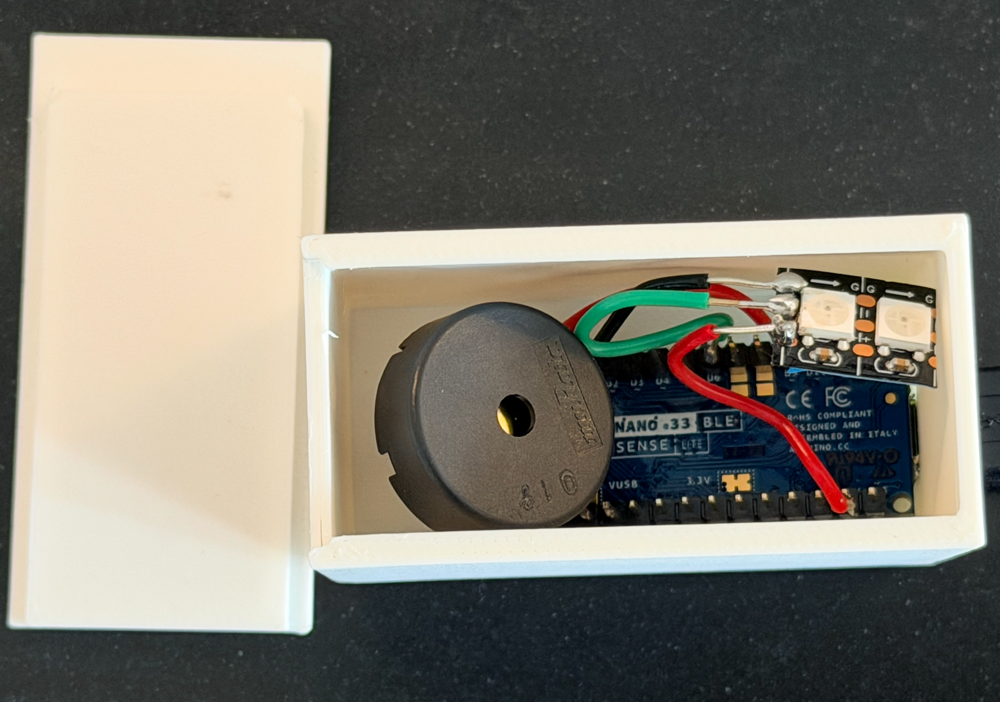
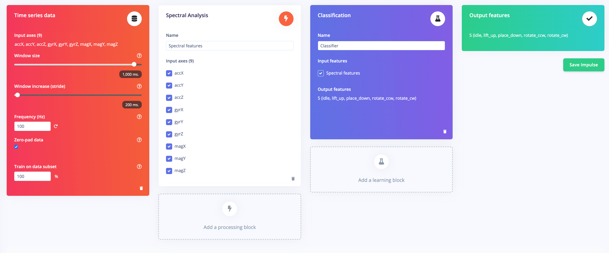
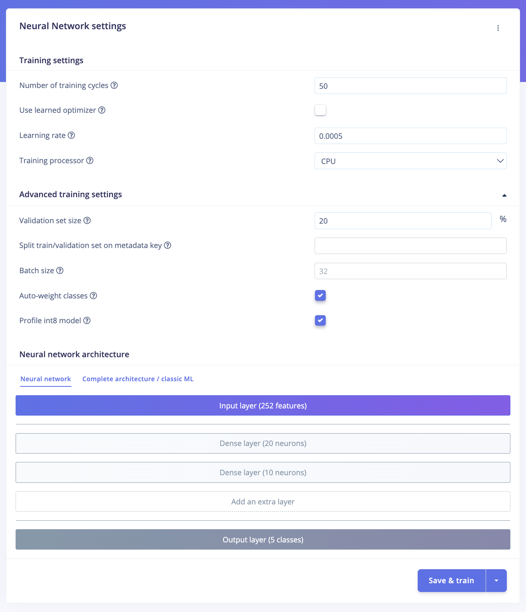
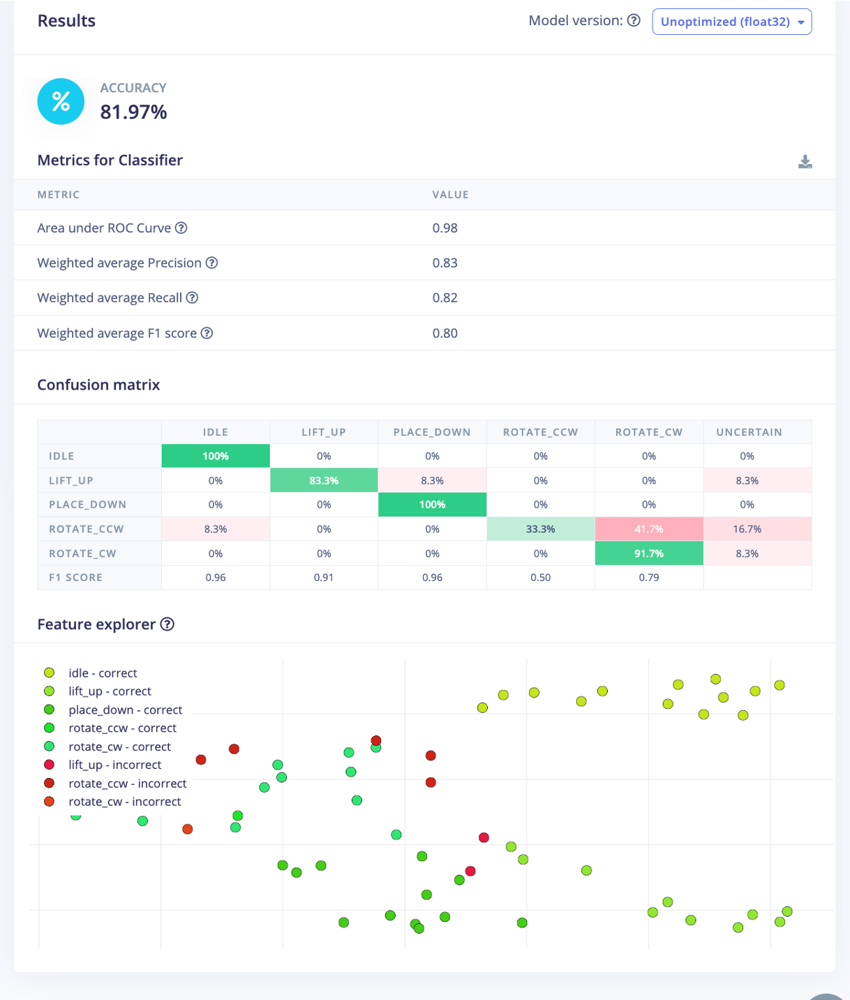
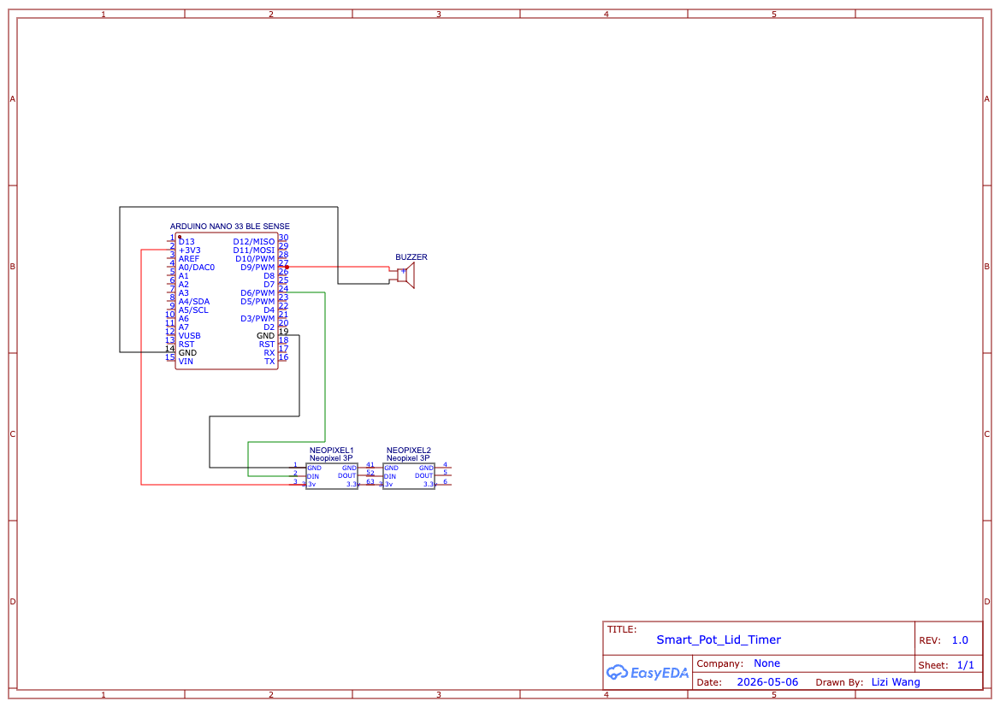

# Smart Pot Lid Timer

An embedded TinyML project exploring contactless kitchen interaction using gesture recognition on the Arduino Nano 33 BLE Sense.

---

## Project Overview

This project investigates how embedded machine learning can support intuitive and hygienic interaction in noisy kitchen environments. Instead of relying on touchscreens or voice assistants, the system transforms a standard pot lid into an intelligent interaction interface.

Natural lid movements such as:

* placing the lid down,
* lifting the lid,
* rotating clockwise,
* rotating anti-clockwise

are recognised using onboard IMU sensor data and mapped directly to cooking timer controls.

The project combines:

* embedded sensing,
* signal processing,
* TinyML deployment,
* real-time inference,
* and finite state machine (FSM) logic

to create a fully self-contained edge AI system capable of operating entirely on-device.

<div align="center">



<p><em>Final hardware prototype of the Smart Pot Lid Timer.</em></p>

</div>

---

## Features

* Real-time gesture recognition
* Contactless timer interaction
* Embedded on-device inference
* TinyML deployment using TensorFlow Lite for Microcontrollers
* Finite State Machine (FSM) interaction logic
* LED and buzzer feedback
* Low-power edge AI operation

---

## Hardware Components

* Arduino Nano 33 BLE Sense (with onboard LSM9DS1 IMU)
* NeoPixel LEDs
* Piezo buzzer
* 3D-printed enclosure

---

## Gesture Controls

| Gesture    | Action             |
| ---------- | ------------------ |
| place_down | Start timer        |
| rotate_ccw | Add time           |
| rotate_cw  | Reduce time        |
| lift_up    | Stop / reset timer |


---

## System Pipeline

<div align="center">



<p><em>Edge Impulse processing pipeline for embedded gesture recognition.</em></p>

</div>

The system follows a real-time perception–inference–action loop:

1. Motion data is collected from the onboard IMU sensor
2. Signals are processed using spectral and wavelet analysis
3. A lightweight neural network classifies gestures
4. FSM logic maps predictions to timer behaviour
5. LEDs and buzzer provide feedback to the user

---

## Machine Learning Model

The gesture classification model was developed using Edge Impulse and deployed locally using TensorFlow Lite for Microcontrollers.

### Model Configuration

* 252 input features
* Dense layer (20 neurons)
* Dense layer (10 neurons)
* 5 gesture classes
* INT8 quantised inference

### Final Performance

* Validation accuracy: 92.5%
* Test accuracy: 81.97%
* Inference latency: ~1 ms

<div align="center">



<p><em>Lightweight neural network architecture used for embedded deployment.</em></p>

</div>

---

## Experimental Results

The project explored:

* dataset variability,
* window sizing,
* feature extraction methods,
* filtering strategies,
* and deployment constraints.

One major challenge was environmental vibration noise generated during cooking. A 10 Hz low-pass filter was introduced to reduce false positives caused by boiling water and stovetop activity.

<div align="center">



<p><em>Confusion matrix for the held-out test dataset.</em></p>

</div>

---

## Quick Start

### Hardware Requirements

* Arduino Nano 33 BLE Sense
* NeoPixel LEDs
* Piezo buzzer
* USB cable
* Pot lid with attached enclosure
* Jumper wires
  
<div align="center">



<p><em>Hardware wiring diagram showing the connections between the Arduino Nano 33 BLE Sense, NeoPixel LEDs, and buzzer used for gesture feedback and timer interaction.</em></p>

</div>


### Software Requirements

* Arduino IDE 2.x
* Edge Impulse exported Arduino library

### Required Arduino Libraries

* Arduino_LSM9DS1
* Adafruit NeoPixel

### Installation Steps

1. Clone or download this repository.

2. Open the Arduino project located in:

```plaintext
projects/final-project/arduino/
```

3. Install the required Arduino libraries using the Arduino Library Manager.

4. Import the Edge Impulse exported library from:

```plaintext
projects/final-project/edge-impulse-export/
```

5. Connect the Arduino Nano 33 BLE Sense via USB.

6. In Arduino IDE, select:

* Board: Arduino Nano 33 BLE
* Correct serial port

7. Upload the firmware to the device.

8. Open the Serial Monitor at:

```plaintext
115200 baud
```

9. Interact using pot lid gestures:

* place_down → start timer
* rotate_ccw → add time
* rotate_cw → reduce time
* lift_up → stop/reset

---

## Repository Structure

```plaintext
report/
    report.md
    report.pdf
    images/

projects/
    final-project/
        arduino/
        enclosure/
        dataset/
        edge-impulse-export/
```

---

## Repository Guide

### report/

Contains the formal coursework report, exported PDF, and all figures used in the documentation.

### projects/final-project/

Contains:

* Arduino firmware
* Edge Impulse exports
* datasets
* enclosure STL files
* implementation assets

### dataset/

Contains motion data records and experimental exported datasets collected during development from Edge Impulse.

### edge-impulse-export/

Contains exported deployment packages generated from Edge Impulse.

### enclosure/

Contains STL files for the 3D-printed enclosure used to mount the device onto the pot lid.

---

## Additional Documentation

### Demonstration Video

https://youtu.be/cknqdoWq6qU

### Edge Impulse Project

https://studio.edgeimpulse.com/public/959894/live

---

## Author

Lizi Wang

UCL CASA0018 — Deep Learning for Sensor Networks 25/26
