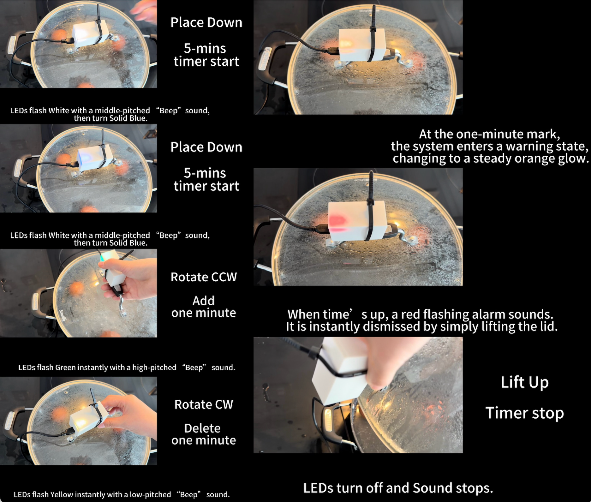
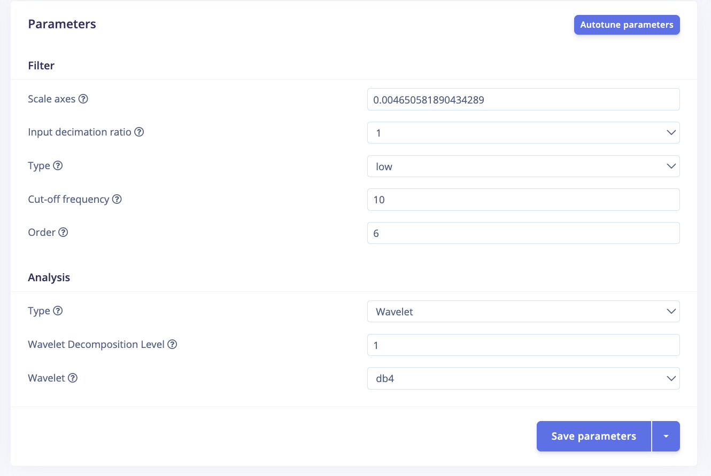
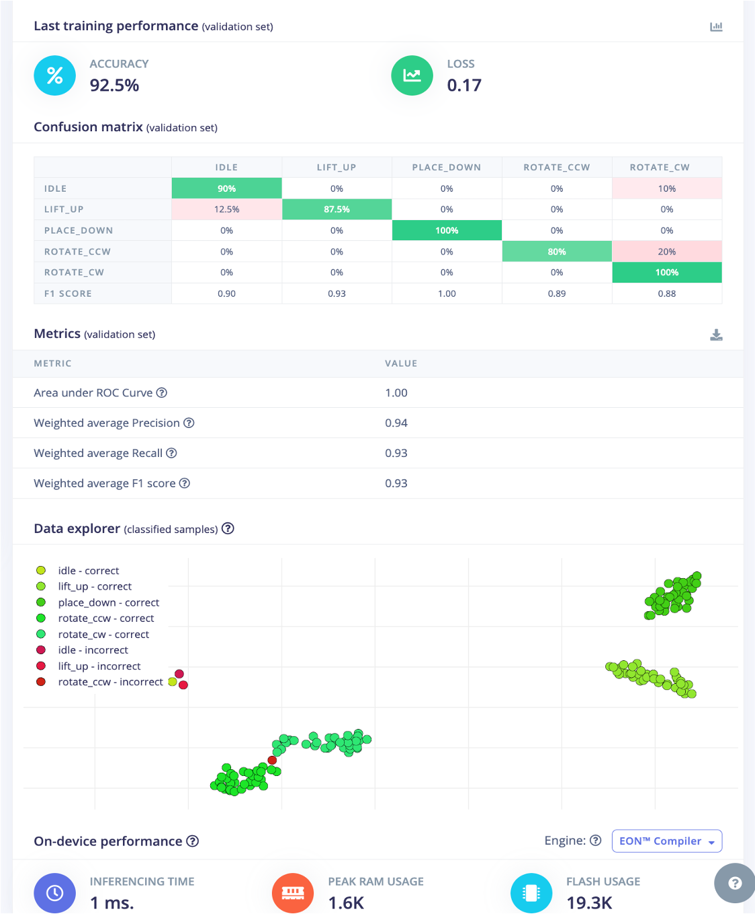

# Smart Pot Lid Timer: Edge-based Gesture Recognition for Contactless Kitchen Timing

**Name:** LIZI WANG

**GitHub:** https://github.com/Lizzim24/casa0018/tree/main/Assessment

**Edge Impulse Project:** https://studio.edgeimpulse.com/public/959894/live

**Project demonstration video:** [YouTube Link](https://youtu.be/cknqdoWq6qU)

## Introduction
This project explores the use of embedded machine learning to enable contactless interaction in kitchen environments. The inspiration comes from a common issue observed during cooking: users often need to interact with timers while their hands are wet, greasy, or contaminated. This creates a “hygiene paradox,” where interaction is required at the least suitable moment. In both domestic and professional kitchens, this issue affects not only convenience but also hygiene and workflow efficiency, particularly when users are handling raw ingredients or working in fast-paced cooking conditions.

Existing solutions such as voice assistants offer hands-free interaction but are unreliable in noisy environments. Kitchen noise from extractor fans, boiling liquids, frying sounds, and background conversations can interfere with speech recognition, reducing usability and increasing recognition errors. Camera-based gesture recognition systems provide another alternative but introduce privacy concerns, require additional hardware, and are sensitive to lighting conditions and camera positioning. These limitations reduce their practicality for everyday use in compact kitchen environments.

This project proposes a different approach by transforming a pot lid into an implicit input device. Instead of learning artificial gestures, the system recognises natural interactions such as placing, lifting, and rotating the lid, mapping them directly to timer control functions. The objective is to create an interaction method that feels intuitive and requires minimal behavioural adaptation from the user.

More broadly, the project investigates how embedded sensing and machine learning can support context-aware interaction in constrained physical environments. By combining real-time motion recognition with embedded system integration, the project demonstrates how everyday objects can become intelligent interaction interfaces without relying on cloud connectivity or external sensing infrastructure.

## Research Question
How can reliable, contactless interaction be achieved in a noisy and physically constrained kitchen environment using embedded sensing and machine learning?

## Application Overview
The system is designed as a real-time embedded interaction pipeline consisting of three main components: sensing, inference, and actuation.

The sensing component uses the onboard IMU of the Arduino Nano 33 BLE Sense to capture motion data across accelerometer, gyroscope, and magnetometer axes (Arduino, no date). These signals represent the physical interactions performed on the pot lid.

The inference component is implemented using a neural network trained in Edge Impulse and deployed locally via TensorFlow Lite for Microcontrollers, following TinyML principles for low-power embedded AI systems (Warden and Situnayake, 2020). Sensor data is processed in fixed-size windows, transformed into feature representations, and classified into predefined gesture categories.

The actuation component translates classification outputs into system behaviour. A Finite State Machine (FSM) manages timer states (IDLE, COUNTING, WARNING, ALARM) and ensures context-aware responses. User feedback is provided through LEDs and a buzzer, enabling intuitive interaction without a screen.

Together, these components form a complete perception–inference–action loop suitable for real-time embedded systems.

*Figure 1. Final hardware prototype containing the Arduino Nano 33 BLE Sense, buzzer, NeoPixel LEDs, and enclosure used for embedded gesture recognition and timer feedback.*

| State | Trigger | Action | Feedback |
|---|---|---|---|
| IDLE | place_down | Start timer (5-mins) | White LED + short beep then turn solid Blue LED |
| COUNTING | rotate_ccw | Add time (1-min) | Green LED + high beep |
| COUNTING | rotate_cw | Reduce time (1-min) | Yellow LED + low beep |
| WARNING | Remaining < 1 min | Enter warning mode | Orange LED |
| ALARM | Timer reaches zero | Activate alarm | Red blinking LED + Keep Buzzing |
| ALARM | lift_up | Stop alarm | LEDs off + Buzzer stop|

*Table 1. Finite State Machine logic used for timer control and interaction handling.*

*Figure 2. System behaviour across different interaction states, including countdown, warning, and alarm feedback modes.*

*Figure 3. Edge Impulse processing pipeline illustrating time-series acquisition, spectral feature extraction, and embedded gesture classification.*

## Data
Data was collected using the LSM9DS1 IMU sensor, capturing nine-axis motion signals. Five gesture classes were defined: place_down, lift_up, rotate_cw, rotate_ccw, and idle.

To improve signal separability, the sensor was mounted with the Z-axis perpendicular to the lid surface. This ensured that rotational gestures produced strong gyroscope signals, while placement gestures were captured through acceleration changes.

A limitation of the dataset was the use of a single lid. To mitigate overfitting, variability was introduced by involving multiple users and performing gestures with different speeds and levels of force. This allowed the model to learn general motion patterns rather than device-specific characteristics.

A key preprocessing improvement was the transition from variable-length windows to fixed 1000 ms windows. Earlier approaches resulted in “temporal smearing,” where idle segments diluted meaningful gesture signals. The fixed window ensured that gestures occupied a consistent proportion of each sample window, improving feature clarity.

Feature extraction was performed using spectral and wavelet analysis. A 10 Hz low-pass filter was applied to remove high-frequency noise, resulting in a 252-dimensional feature vector.

*Figure 4. Dataset overview in Edge Impulse, showing total collected samples and train/test split used during model development.*

## Model
The gesture recognition model was implemented using the Edge Impulse platform and designed specifically for deployment on resource-constrained embedded hardware. The final model architecture consists of an input layer with 252 extracted features, followed by two fully connected (dense) layers with 20 and 10 neurons respectively, and a softmax output layer representing five gesture classes.

The model was intentionally kept lightweight to meet the memory and computational constraints of the Arduino Nano 33 BLE Sense. This design choice reflects a trade-off between model complexity and deployment feasibility, which is a key consideration in embedded machine learning systems (Warden and Situnayake, 2019).

During development, alternative configurations were explored. Earlier iterations included larger network sizes and longer input windows, which initially produced higher validation accuracy but resulted in overfitting and poor generalisation on unseen data. Reducing the number of neurons and refining input representations improved stability and reduced variance between validation and test performance.

Feature extraction was performed using a combination of spectral analysis and wavelet transformation. Wavelet-based features were selected over traditional FFT methods due to their ability to preserve temporal localisation, which is critical for distinguishing short-duration gestures (Lara and Labrador, 2013). This allowed the model to capture both frequency-domain patterns and time-dependent variations in motion signals.

Additionally, class weighting was applied during training to address minor imbalances in the dataset, ensuring that less frequent gestures were not underrepresented during optimisation. The final model was trained over 50 epochs using a learning rate of 0.0005 and a batch size of 32.

Overall, the model design reflects a balance between computational efficiency, classification performance, and real-world deployability, which are central challenges in edge-based AI systems.

*Figure 5. Lightweight neural network architecture used for embedded gesture classification.*

## Experiments
A series of experiments were conducted to evaluate model performance and improve generalisation. The experimental process focused on three main aspects: dataset design, sampling strategy, and feature extraction.

Initial experiments used a limited dataset with approximately equal samples per class but minimal variation. While this configuration produced high validation accuracy, performance on unseen test data was significantly lower, indicating overfitting. To address this, additional data was collected with increased diversity, including multiple users and variations in gesture execution speed and style.

Sampling strategies were also evaluated. Early implementations used variable-length windows, which introduced “temporal smearing,” where irrelevant idle segments diluted meaningful gesture signals. Transitioning to fixed 1000 ms windows significantly improved classification performance by ensuring that gestures occupied a consistent proportion of each sample.

Feature extraction methods were compared to assess their impact on classification accuracy. Wavelet-based features consistently outperformed FFT-based approaches, as they preserved temporal characteristics essential for distinguishing short-duration gestures (Edge Impulse, no date). This was particularly important for differentiating between rotational gestures with similar frequency patterns but different temporal profiles.

*Figure 6. Digital signal processing configuration used for feature extraction, including low-pass filtering and wavelet-based analysis.*

Model performance was evaluated using multiple metrics, including accuracy, precision, recall, and F1 score. Confusion matrices generated by Edge Impulse provided detailed insight into class-level performance and misclassification patterns.

The final model achieved 92.5% accuracy on the validation set and 81.97% on the test set, with a weighted F1 score of 0.80. On-device deployment demonstrated low inference latency and efficient memory usage, reflecting the importance of lightweight inference techniques in embedded AI systems (Lane et al., 2016). The discrepancy between validation and test performance highlights the challenges of real-world variability and the importance of robust dataset design.

These experiments demonstrate that improvements in embedded machine learning systems are driven not only by model architecture, but also by careful data design, preprocessing strategies, and evaluation methods.

 
*Figure 7. Confusion matrix for validation dataset (accuracy: 92.5%).*

## Results and Observations
The final model demonstrated strong performance across most gesture classes, particularly for place_down and rotate_cw, both of which achieved near-perfect classification accuracy in the validation dataset. The idle class also performed reliably under controlled conditions, although occasional false positives occurred when small environmental vibrations were interpreted as intentional motion. 

The most significant limitation was the confusion between rotate_ccw and rotate_cw. Analysis of the confusion matrices revealed that anti-clockwise rotations were frequently classified as clockwise rotations, particularly when gestures were performed slowly or inconsistently. This indicates that directional rotation is inherently difficult to distinguish using IMU data alone, as both gestures share highly similar motion patterns and frequency characteristics. In practice, the direction is often represented primarily by the sign of the gyroscope signal rather than by large structural differences in the feature space.

One of the most important observations throughout development was that data quality had a greater impact on performance than model complexity. Earlier versions of the dataset contained long motion trajectories and inconsistent gesture timing, which introduced unnecessary variability and caused overfitting. Although these early models achieved high validation accuracy, performance on unseen test data remained poor. Refining gesture definitions to focus on short, semantically meaningful interaction events significantly improved generalisation performance.

Environmental noise also proved to be a major challenge. During testing in realistic cooking conditions, boiling water and stovetop activity generated high-frequency “micro-vibrations” that occasionally triggered the place_down gesture unintentionally. To address this issue, a 10 Hz low-pass filter was introduced during signal processing, effectively removing irrelevant vibration noise while preserving intentional human motion. This modification substantially reduced false positives and improved system stability in real-world environments.

The embedded deployment phase highlighted additional practical considerations. A confidence threshold of 0.8 was implemented to reject low-probability predictions, reducing accidental activations caused by ambiguous sensor data. Furthermore, integrating the model into a Finite State Machine (FSM) significantly improved interaction reliability. The FSM constrained valid transitions between IDLE, COUNTING, WARNING, and ALARM states, ensuring that gestures were interpreted differently depending on system context. For example, a place_down gesture only starts the timer when the device is idle, while lift_up cancels or resets the timer during active operation.

On-device deployment results demonstrated efficient real-time performance. Using the EON compiler, the model achieved approximately 1 ms inference time with a peak RAM usage of 1.6 KB and flash usage of 19.3 KB. These results confirm that the system is suitable for low-power edge AI applications and aligns with the lightweight inference principles discussed by Lane et al. (2016).

Despite these successes, the project still exhibits a clear generalisation gap. The use of only a single lid means that the model may partially depend on hardware-specific characteristics such as weight, inertia, and surface friction. Although involving multiple users improved robustness, the system may still behave differently when applied to heavier or differently shaped lids. Future work should therefore focus on expanding the dataset across a wider range of lid materials, users, and environmental conditions.

Additional improvements could also include hybrid interaction logic combining machine learning with rule-based motion analysis. For example, the neural network could detect rotational motion while simple gyroscope threshold rules determine direction more reliably. Adaptive confidence thresholds could also personalise sensitivity to different users over time.

Overall, the project demonstrates that embedded machine learning can provide a viable and practical alternative to traditional touch- or voice-based interaction in noisy environments. More importantly, the project highlights that reliable embedded AI systems depend not only on classification accuracy, but also on careful dataset design, signal processing, filtering logic, and system-level integration.

*Figure 8. Confusion matrix for the held-out test dataset, showing remaining confusion between clockwise and anti-clockwise rotational gestures (overall accuracy: 81.97%).*

## Bibliography
1. Arduino Nano 33 BLE (no date) Arduino Official Store. Available at: https://store.arduino.cc/products/arduino-nano-33-ble (Accessed: 06 May 2026).
2. Lane, N.D. et al. (2016) ‘DeepX: A software accelerator for low-power deep learning inference on mobile devices’, 2016 15th ACM/IEEE International Conference on Information Processing in Sensor Networks (IPSN), pp. 1–12. doi:10.1109/ipsn.2016.7460664.
3. Lara, O.D. and Labrador, M.A. (2013) ‘A survey on human activity recognition using wearable sensors’, IEEE Communications Surveys &amp; Tutorials, 15(3), pp. 1192–1209. doi:10.1109/surv.2012.110112.00192. 
4. Motion recognition with anomaly detection (no date) Edge Impulse Documentation. Available at: https://docs.edgeimpulse.com/tutorials/end-to-end/motion-recognition (Accessed: 06 May 2026).
5. Warden, P. and Situnayake, D. (2020) TinyML: Machine learning with tensorflow lite on Arduino and ultra-low Power Microcontrollers. Sebastopol, CA: O’Reilly Media Inc.
----

## Declaration of Authorship
I, Lizi Wang, confirm that the work presented in this assessment is my own. Where information has been derived from other sources, I confirm that this has been indicated in the work.

Digitally Signed: 

Date: 

Word count: 1784
